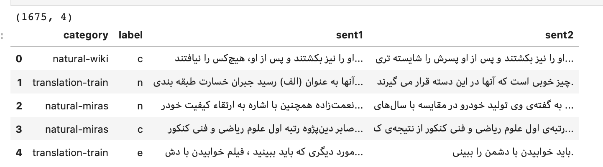

# PasiNLU dataset classification
 
This task uses Transformers in Textual Entailment, which is one of the natural language processing applications. Textual Entailment is actually a classification that can be used to understand the relationship between two sentences. In this task, the Persian dataset "parsinlu_entailment" published by the ParsiNLU article has been used.

An example of an training dataset is as follows.

